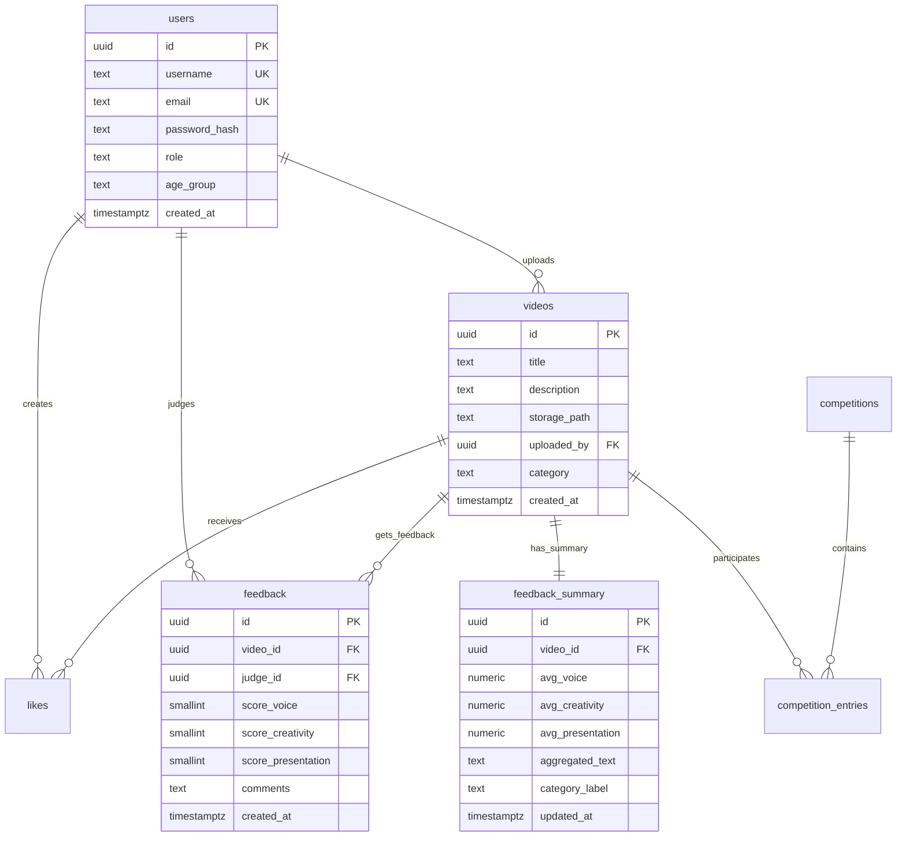

# TalentUp Sri Lanka - Online Talent Show Platform

A comprehensive online talent show platform for rural youth in Sri Lanka, featuring video uploads, judge feedback, and automated categorization based on structured scoring.

## Features

- **Three-role system**: Users (upload videos), Judges (provide feedback), Admins (full management)
- **Video uploads**: MP4 files up to 50MB with Supabase storage
- **Structured feedback**: Judges score voice, creativity, and presentation (0-10 scale)
- **Automated categorization**: Based on judge feedback patterns
- **Multilingual**: English, Sinhala, and Tamil support
- **Mobile-first design**: Responsive with internal CSS
- **Secure**: CSRF protection, role-based access, file validation

## Database Schema (ERD)



To export this diagram as PNG: Copy the mermaid code to [mermaid.live](https://mermaid.live) or use `mmdc -i diagram.mmd -o diagram.png`

## Local Development Setup

### Prerequisites
- Node.js 18+
- Supabase account
- Git

### 1. Clone and Install
```bash
git clone https://github.com/mohamadhusni1255-commits/ICBT-Final-Project.git
cd ICBT-Final-Project
npm install
```

### 2. Supabase Project Setup

#### Create Supabase Project
1. Go to [https://supabase.com/dashboard](https://supabase.com/dashboard)
2. Create new project
3. Wait for database setup (2-3 minutes)

#### Get API Keys
1. Go to Settings > API
2. Copy `Project URL` and `anon public` key
3. Copy `service_role` key (keep secret!)

#### Run Database Migrations
1. Go to SQL Editor in Supabase dashboard
2. Copy contents of `migrations/2025_01_15_create_tables.sql`
3. Run the query
4. Verify tables are created in Database > Tables

#### Setup Storage Bucket
1. Go to Storage in Supabase dashboard
2. Create bucket named `videos`
3. Set bucket to **Public** (for thumbnail access)
4. Go to Storage Settings
5. Add CORS policy:
```json
[
  {
    "allowedOrigins": ["*"],
    "allowedHeaders": ["*"],
    "allowedMethods": ["GET", "POST", "PUT", "DELETE"],
    "maxAgeSeconds": 3000
  }
]
```

### 3. Environment Configuration
```bash
cp config.env.example .env
```

Edit `.env` with your Supabase credentials:
```
SUPABASE_URL=https://your-project.supabase.co
SUPABASE_SERVICE_KEY=your-service-role-key
SUPABASE_ANON_KEY=your-anon-key
SUPABASE_STORAGE_BUCKET=videos
APP_URL=http://localhost:3000
NODE_PORT=3000
SESSION_SECRET=your-random-secret-key-here
```

### 4. Seed Sample Data
Run seed SQL in Supabase SQL Editor:
```bash
# Generate password hashes first:
node -e "const bcrypt = require('bcrypt'); console.log('admin123:', bcrypt.hashSync('admin123', 10));"
node -e "const bcrypt = require('bcrypt'); console.log('judge123:', bcrypt.hashSync('judge123', 10));"
node -e "const bcrypt = require('bcrypt'); console.log('user123:', bcrypt.hashSync('user123', 10));"
```

Copy the generated hashes and update `sample_seed.sql`, then run it in SQL Editor.

### 5. Download Assets
```bash
chmod +x scripts/download_assets.sh
./scripts/download_assets.sh
```

### 6. Start Development Server
```bash
npm run dev
```

Visit `http://localhost:3000`

**Default Test Accounts:**
- Admin: `admin@example.com` / `admin123`
- Judge: `judge1@example.com` / `judge123` 
- User: `user1@example.com` / `user123`

## Deployment

### Node.js Deployment (Primary)
1. Deploy to services like Railway, Render, or Heroku
2. Set environment variables
3. Ensure Supabase storage bucket has correct CORS settings
4. Update `APP_URL` in production

### PHP Hosting Deployment (Fallback)
If Node.js hosting isn't available:
1. Upload `php_api/` folder to web server
2. Configure database connection in each PHP file
3. Update client-side API calls to use PHP endpoints
4. Ensure server has PDO and curl extensions

## GitHub Setup

### Initial Repository
```bash
git init
git add .
git commit -m "Initial TalentUp Sri Lanka platform"
git branch -M main
git remote add origin https://github.com/mohamadhusni1255-commits/ICBT-Final-Project.git
git push -u origin main
```

### Ongoing Development
```bash
git add .
git commit -m "Your commit message"
git push
```

## File Upload Guidelines

### For Contributors (Video Optimization)
To reduce file sizes, compress videos before upload:
```bash
ffmpeg -i input.mp4 -vf scale=854:480 -crf 28 -preset medium -aac_bitrate 96k output_480p.mp4
```

### Server-side Validation
- File type: MP4 only
- Max size: 50MB (configurable)
- MIME type validation with finfo
- Temporary storage before Supabase upload

## Performance Guidelines

### Low-bandwidth Optimizations
- Lazy-load video thumbnails
- Paginate video lists (12 per page)
- Use signed URLs with expiration
- Minimal JavaScript bundles
- Internal CSS only (no external frameworks)

### Client-side Caching
```javascript
// Language files cached in localStorage
localStorage.setItem('lang_cache', JSON.stringify(langData));
```

## Security Implemented

- **Authentication**: bcrypt password hashing, session management
- **Authorization**: Role-based access control (RLS policies)
- **CSRF Protection**: Token validation on all POST requests
- **File Validation**: MIME type checking, extension validation
- **SQL Injection**: Parameterized queries only
- **XSS Protection**: HTML escaping on output

## API Integration Notes

The platform includes a secure placeholder for future AI API integration:
- Admin panel has API key storage UI
- No actual API calls implemented
- Categorization based purely on judge feedback patterns
- Ready for future enhancement while maintaining current functionality

## Troubleshooting

### Common Issues
1. **Storage upload fails**: Check CORS settings and service role key
2. **Authentication issues**: Verify RLS policies and session configuration
3. **Video playback fails**: Ensure signed URL generation works
4. **Language toggle broken**: Check static file serving for `/lang/` directory

### Development Commands
```bash
# Test aggregation job
node src/jobs/aggregate_feedback.js

# Generate CSRF token
node -e "console.log(require('crypto').randomBytes(32).toString('hex'));"

# Check Supabase connection
node -e "const {createClient} = require('@supabase/supabase-js'); const supabase = createClient(process.env.SUPABASE_URL, process.env.SUPABASE_SERVICE_KEY); supabase.from('users').select('count').then(console.log);"
```

## License

MIT License - Feel free to adapt for your own projects.
